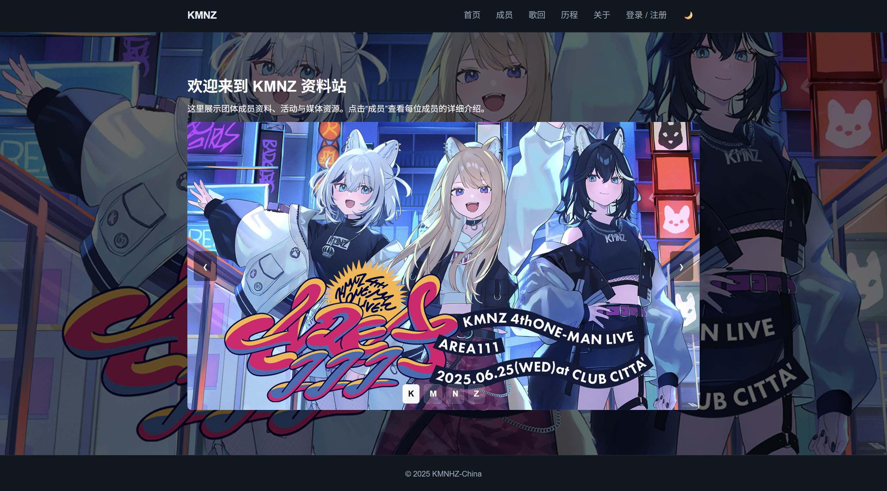

# KMNZ 资料站

这是一个纯静态站点，可以直接打开 HTML，也可以用本地静态服务器预览。

## 页面预览



## 目录结构

```text
.
├── index.html              # 首页
├── members.html            # 成员列表
├── member1.html            # LITA
├── member2.html            # TINA
├── member3.html            # NERO
├── member4.html            # LIZ
├── history.html            # 历程
├── about.html              # 关于和链接
├── auth.html               # 登录 / 注册
├── reset.html              # 重置密码
├── user.html               # 个人中心
├── songcover.html          # 歌回封面导入
├── assets/
│   ├── fonts/
│   └── images/
├── css/
│   └── style.css           # 全站样式
└── js/
    ├── config.js           # 站点配置默认值
    ├── data.js             # 成员数据
    ├── main.js             # 全站通用交互
    ├── profile.js          # 个人中心交互
    ├── songcover.js        # 歌回页交互
    └── theme.js            # 主题初始化和切换
```


<p align="center">
  
</p>
